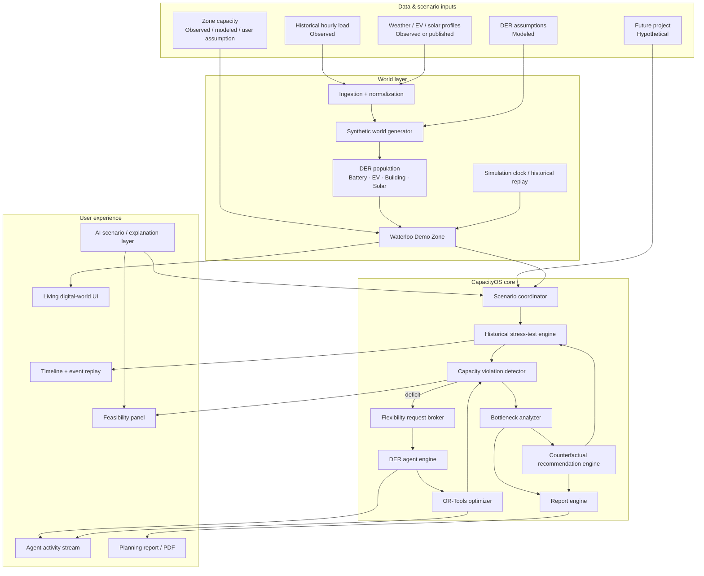
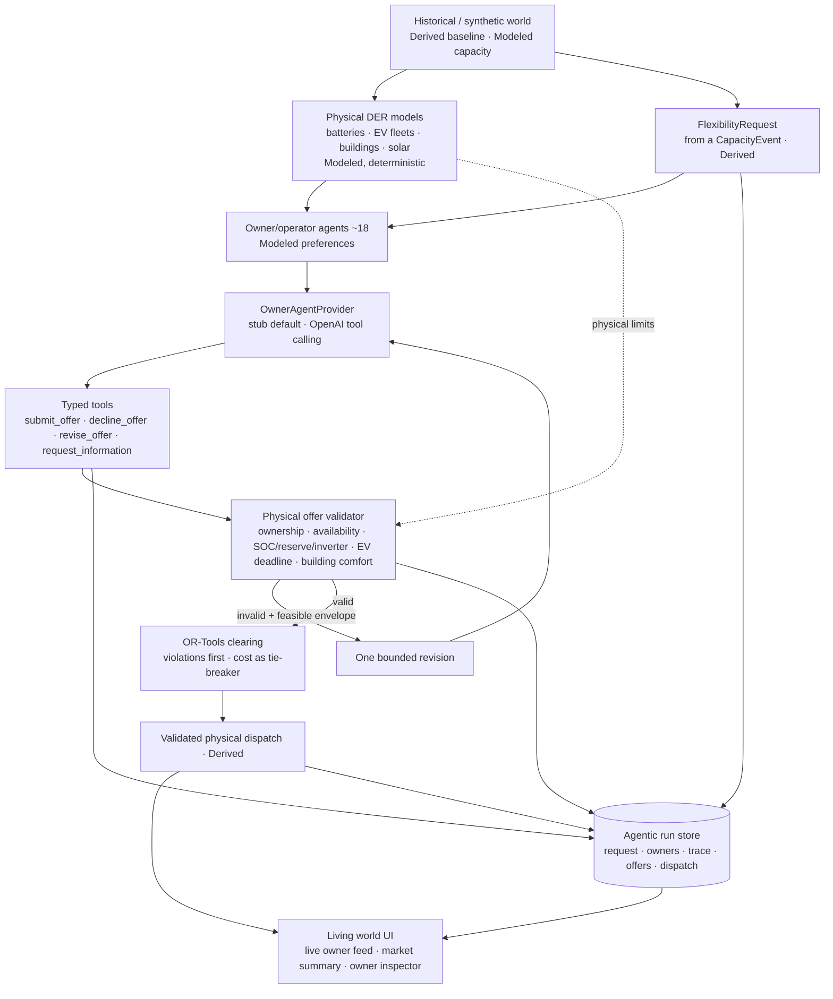
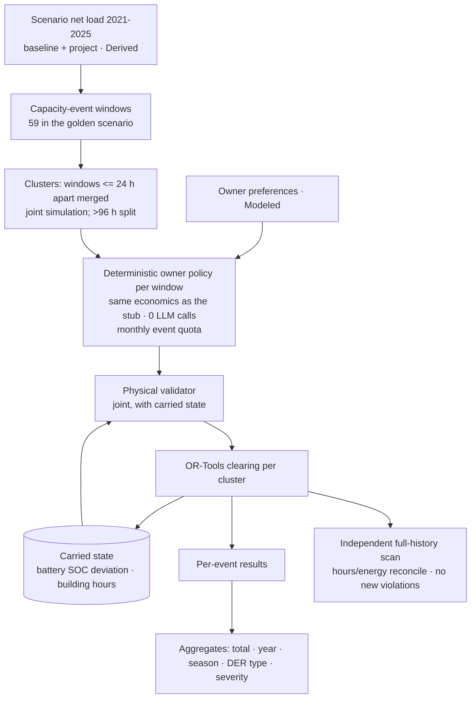

# CapacityOS Architecture

## High-level view



## Agentic decision layer (Phase 5-6)

Two different "agents" — never conflate them:
- **Physical DER model** (deterministic Python): Battery B-04, EV Fleet EV-09, Building BL-21. Owns SOC, deadlines, limits, availability.
- **Owner / operator agent** (behavioral; stub or LLM): decides whether/how much/when/at what price the DERs it controls are offered. Never violates physics.



Trust boundary: LLM output is untrusted input. It is parsed into typed tool calls, schema-validated, then physically validated. Only validated offers reach the optimizer; the optimizer's own constraints still apply on top. Deterministic code alone owns world state (SOC, load, scenario, limits, history, capacity, project demand).

The orchestration is a small explicit state machine (`receive_request → inspect_assets → owner_decision → physical_validation → [one revision → physical_validation] → accepted | rejected | declined`) in plain Python (`apps/api/src/owners/runner.py`). LangGraph/LangChain/MCP are deliberately NOT used: the flow is 4 states, must be deterministic/replayable and auditable, and an extra framework would hide it. OpenAI is the only new (optional) dependency.

Modes: **Manual** (participation sliders → deterministic, no LLM) and **Agentic** (participation = owner decisions on the request). LLM calls happen only for selected events (≈18 owner calls per run, +≤1 revision each), never per physical DER and never over the 43,824-hour history.

## Historical coordination engine (Phase 7)



Continuity rules: a chronological loop; windows separated by <= `mergeGapHours` (default 24 h, always >= the recovery tail) are ONE joint simulation (one SOC trajectory, EV balance and per-24 h building comfort budget); between clusters the battery deviation from its routine is carried and recovered only within inverter spare power and zone headroom below capacity (so recharging cannot create a violation); building curtailment hours of the previous 24 h are carried. Only event windows are coordinated — LLM calls never touch history (Agentic Mode with real LLM owners stays a selected-event demonstration and is labelled `decisionSource=llm_openai`).

## Data truth layers

```text
OBSERVED
Historical aggregate load / sourced public profiles
        ↓
MODELED
Synthetic DER population / capacity assumption / participation / SOC / owner-agent preferences and behavior
        ↓
HYPOTHETICAL
New data centre / housing / EV depot / future growth
        ↓
DERIVED
Capacity events / dispatch / feasibility / recommendations
```

## Core runtime sequence

```mermaid
sequenceDiagram
  actor User
  participant UI as CapacityOS UI
  participant World as Synthetic World
  participant Core as CapacityOS Coordinator
  participant Agents as DER Agents
  participant Opt as OR-Tools Optimizer

  User->>UI: Add 20 MW data centre
  UI->>Core: Create/update scenario
  Core->>World: Overlay project on historical baseline
  Core->>World: Run historical stress test
  World-->>Core: Capacity deficit at constrained hours
  Core->>Agents: Request required flexibility
  Agents-->>Core: Offers + declines + constraints
  Core->>Opt: Optimize feasible dispatch
  Opt-->>Core: Dispatch plan / remaining deficit
  Core->>World: Apply dispatch and recompute
  World-->>UI: Updated capacity state
  Core-->>UI: Feasibility + bottlenecks
  Core->>Core: Run counterfactual recommendations
  Core-->>UI: Validated pathways
  User->>UI: Apply recommendation
  UI->>Core: Rerun scenario
  Core-->>UI: Verified new result
```

## Technology architecture

```text
┌─────────────────────────────────────────────────────────────┐
│                         NEXT.JS UI                          │
│ Living world · timeline · project builder · feasibility    │
│ agent feed · recommendations · reports · AI commands       │
└───────────────────────────┬─────────────────────────────────┘
                            │ REST + SSE
┌───────────────────────────▼─────────────────────────────────┐
│                        FASTAPI API                          │
│ scenario coordinator · simulation · stress test            │
│ recommendations · report generation                        │
├─────────────────────┬───────────────────┬───────────────────┤
│ DER Agent Engine    │ OR-Tools         │ Data adapters     │
│ deterministic state │ optimization     │ load/profiles     │
└─────────────────────┴───────────────────┴───────────────────┘
                            │
              ┌─────────────▼─────────────┐
              │ Postgres/Supabase +       │
              │ Parquet historical data  │
              └───────────────────────────┘
```

## MVP boundary

The MVP has one aggregate local capacity constraint. It does not model feeder impedances, transformer-specific flows, voltage, protection, N-1 contingencies, or full utility-network power flow.

That is intentional. CapacityOS MVP is a **capacity-planning and flexibility sandbox**, not a utility engineering sign-off tool.
