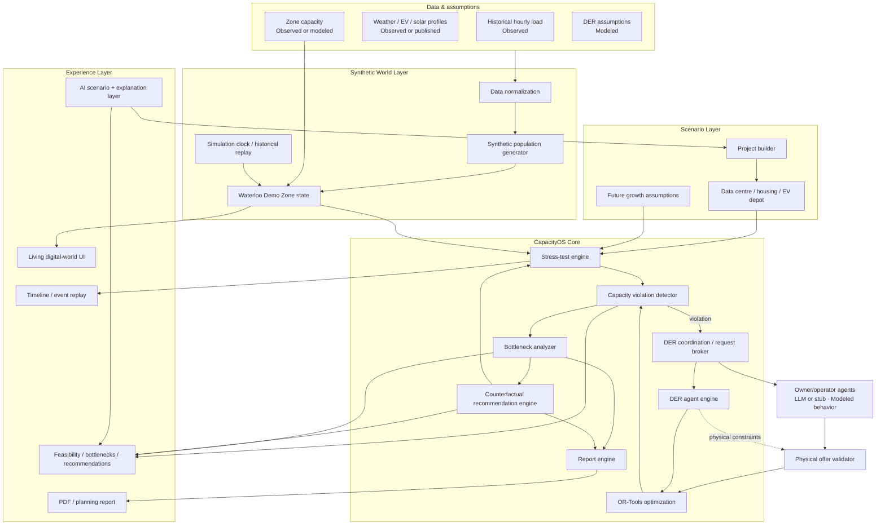

# CapacityOS — Master Claude Code Build Specification

> **This file is the source of truth for implementation.**
>
> Build CapacityOS as a working, demo-ready hackathon product. Do not reinterpret the product into a generic dashboard or a chat app. The core experience is an interactive digital electricity world where a user adds future electrical demand, stress-tests it against historical conditions, watches distributed-energy-resource (DER) agents respond, sees whether the project is capacity-feasible, receives simulation-backed recommendations, applies those recommendations, and generates a planning report.

---

# 0. Executive summary

CapacityOS is an **interactive agent-based local-grid planning sandbox**.

It uses several years of **real historical hourly electricity demand** as the environmental baseline for one local area. Because public hourly load data is aggregate and does not reveal every physical asset behind that load, CapacityOS constructs a **synthetic population of DER agents**—batteries, EV fleets, flexible buildings, solar, and optionally industrial demand response—whose aggregate behavior is calibrated to the observed demand environment.

A user can then add a **hypothetical future project** such as a data centre, housing development, or EV charging depot. CapacityOS overlays the project load on the historical environment and runs a multi-year stress test.

For any hour where the modeled local capacity is exceeded, CapacityOS:

1. calculates the capacity deficit;
2. requests flexibility from eligible DER agents;
3. collects offers/declines based on agent state and constraints;
4. runs deterministic mathematical optimization to choose a feasible dispatch;
5. applies that dispatch and recomputes net load;
6. marks the event resolved or unresolved;
7. aggregates recurring failures into bottlenecks;
8. runs counterfactual simulations to determine what changes would make the project feasible;
9. explains the result through an AI interface;
10. generates a traceable planning report.

The visual product should feel like **SimCity / an RTS / a digital-twin sandbox for electricity planning**, not a conventional enterprise dashboard.

---

# 1. Product definition

## 1.1 One-line description

**CapacityOS is an interactive agent-based grid-planning sandbox that uses historical electricity demand, synthetic distributed energy resources, and mathematical optimization to test whether future developments can fit within existing modeled local electrical capacity—and what flexibility would be required to make them feasible.**

## 1.2 Core question

CapacityOS answers:

> **“If we add this new electrical load here, can the local area handle it under realistic historical conditions, and if not, what combination of flexible DER participation, storage, load shifting, project flexibility, or additional infrastructure would make it work?”**

## 1.3 What CapacityOS is

CapacityOS is:

- a planning simulator;
- a synthetic local electricity world;
- an agent-based DER sandbox;
- a historical stress-testing engine;
- a mathematical optimization layer;
- a bottleneck-analysis engine;
- a counterfactual recommendation engine;
- an AI explanation and scenario-control interface;
- a report generator.

## 1.4 What CapacityOS is NOT

CapacityOS is not:

- a utility-grade digital twin;
- a real-time SCADA system;
- a protection/stability study;
- an AC or DC power-flow solver for the MVP;
- a guarantee of electrical interconnection feasibility;
- a claim that every modeled DER corresponds to a real customer;
- a claim that public FSA load data represents every MW in a municipality;
- a chatbot that guesses grid answers;
- thousands of LLM agents.

The MVP is a **zone-level capacity screening and flexibility simulation**.

---

# 2. Product thesis

New housing, EV charging, industrial electrification, data centres, heat pumps, and other loads can push local electrical infrastructure toward capacity limits. Physical grid upgrades can be expensive and slow. At the same time, some electrical demand and local energy resources are flexible in time.

CapacityOS explores the question:

> **How much additional demand could a local area potentially accommodate if flexible resources are coordinated intelligently before physical infrastructure is expanded?**

The project must never imply that software eliminates the need for infrastructure. The correct framing is:

> **Some incremental peak demand may be accommodated or deferred through flexibility; residual constraints may still require physical upgrades.**

---

# 3. Primary users and jobs to be done

## 3.1 Primary users

MVP primary users:

- utility planning analysts;
- municipal energy/infrastructure planners;
- project developers evaluating electrical capacity;
- data-centre / industrial site-development teams;
- engineering / energy consultants.

Secondary/future users:

- DER aggregators;
- demand-response program designers;
- regulators/researchers;
- government infrastructure-planning teams.

## 3.2 Primary job to be done

> **Given a proposed project and explicit assumptions, determine how often it would exceed modeled local capacity under historical operating conditions, whether modeled flexible DERs can resolve those events, and what changes would make the project capacity-feasible.**

## 3.3 Secondary planning question

CapacityOS can also answer:

> **“What DER participation level or flexibility program would be required to accommodate this project?”**

Example output:

> Under the modeled assumptions, the proposed project becomes capacity-feasible across the historical stress test if managed-EV participation increases from 30% to 58% and an additional 2.5 MW of battery discharge capability is available during constrained evening periods.

This is a **simulated participation target**, not an instruction to specific real people.

---

# 4. MVP scope — do not exceed this until the end-to-end loop works

## 4.1 Geography

Build one **Waterloo Demo Zone**.

A “zone” means one bounded local electricity sandbox with:

- one aggregate hourly baseline;
- one modeled capacity constraint;
- one synthetic DER population;
- one or more hypothetical projects.

The zone does not need to correspond exactly to a real feeder, transformer service territory, or municipal boundary unless such data is explicitly sourced.

Prefer labels like:

- `Waterloo Demo Zone`
- `Waterloo-area synthetic capacity zone`

Do not label it as a real utility feeder unless real topology is available.

## 4.2 Historical period

Target 3–5 years of hourly data if available.

If five years are used:

- ~43,800 hourly states;
- use them as a historical stress-test library;
- do not call historical replay a future forecast.

## 4.3 DER types required for MVP

Implement these four first:

1. **Battery storage**
2. **EV fleet / flexible EV charging**
3. **Flexible building / HVAC**
4. **Solar PV**

Optional fifth type after the core loop works:

5. **Industrial / commercial demand response**

Do not implement all possible DER categories before the core demo works.

## 4.4 Project types required for MVP

Implement:

1. **Data centre**
2. **Housing development**
3. **EV charging depot**

Data centre is the flagship demo.

## 4.5 Core loop that must work

```text
Generate/load world
      ↓
Add hypothetical project
      ↓
Run multi-year historical stress test
      ↓
Detect capacity violations
      ↓
DER agents offer/decline flexibility
      ↓
Optimizer selects dispatch
      ↓
Recompute feasibility
      ↓
Explain bottlenecks
      ↓
Generate simulation-backed recommendations
      ↓
Apply recommendation
      ↓
Re-run and verify
      ↓
Generate planning report
```

If this loop is not polished, do not spend time on secondary features.

---

# 5. Data truth model — critical product rule

CapacityOS must visibly distinguish three kinds of information.

## 5.1 OBSERVED

Directly sourced/measured public information.

Examples:

- historical hourly aggregate demand;
- historical weather if used;
- published EV charging profiles;
- published solar/weather profiles;
- actual public DER data if available.

UI badge: `Observed`

## 5.2 MODELED

Synthetic, inferred, assumed, or calibrated data.

Examples:

- synthetic battery agents;
- synthetic EV fleet agents;
- battery SOC;
- DER participation rate;
- building flexibility;
- synthetic load-class decomposition;
- modeled zone capacity when a real limit is unavailable.

UI badge: `Modeled`

## 5.3 HYPOTHETICAL

Future scenario elements added by the user.

Examples:

- new 20 MW data centre;
- 2,000 new homes;
- new EV charging depot;
- future DER adoption increase;
- future demand growth.

UI badge: `Hypothetical`

## 5.4 Provenance requirements

Every important metric must expose its provenance.

At minimum, the UI/report must state:

```text
Historical demand: Observed / source
DER population: Modeled
Zone capacity: Observed, Modeled, or User assumption
New project: Hypothetical
Simulation result: Model output
```

Never silently convert modeled values into observed facts.

---

# 6. Core conceptual architecture



---

# 7. Runtime architecture

## 7.1 Frontend

Preferred stack:

- Next.js
- React
- TypeScript
- Tailwind CSS
- Recharts for graphs
- MapLibre/Mapbox only if a real/geographic map materially helps
- custom SVG/Canvas overlay for the “living world”
- SSE or WebSocket event stream for simulation activity

The UI is not a generic card dashboard. The **world canvas is the hero**.

## 7.2 Backend

Preferred stack:

- Python 3.12+
- FastAPI
- Pydantic
- Pandas or Polars
- OR-Tools
- NumPy
- PostgreSQL / Supabase for persistence

For hackathon scope, keep:

- simulation;
- agents;
- optimization;
- stress testing;
- recommendations;
- report generation

inside one Python backend service.

Do not build microservices, Kafka, Kubernetes, or a multi-agent framework unless the core product is already complete.

## 7.3 AI layer

Use an LLM only for:

- **owner/operator agent behavior** (§13b): synthetic economic/operational decisions (offer / decline / revise) made through typed tools, always physically validated before use;
- natural-language scenario creation;
- explanation of deterministic simulation results;
- question answering over scenario outputs;
- report narrative generation from structured metrics.

Do not use the LLM to calculate dispatch, capacity deficits, SOC evolution, or feasibility.

---

# 8. Recommended repository structure

```text
capacityos/
├── CLAUDE.md
├── README.md
├── ARCHITECTURE.md
├── BUILD_PLAN.md
├── .env.example
├── docker-compose.yml                 # optional
├── apps/
│   ├── web/
│   │   ├── app/
│   │   ├── components/
│   │   │   ├── world/
│   │   │   ├── simulation/
│   │   │   ├── projects/
│   │   │   ├── agents/
│   │   │   ├── feasibility/
│   │   │   ├── recommendations/
│   │   │   └── reports/
│   │   ├── lib/
│   │   ├── hooks/
│   │   └── types/
│   │
│   └── api/
│       ├── pyproject.toml
│       ├── src/
│       │   ├── main.py
│       │   ├── settings.py
│       │   ├── api/
│       │   │   ├── zones.py
│       │   │   ├── worlds.py
│       │   │   ├── scenarios.py
│       │   │   ├── projects.py
│       │   │   ├── simulations.py
│       │   │   ├── recommendations.py
│       │   │   └── reports.py
│       │   ├── data/
│       │   │   ├── ingestion.py
│       │   │   ├── normalization.py
│       │   │   ├── provenance.py
│       │   │   └── repositories.py
│       │   ├── world/
│       │   │   ├── zone.py
│       │   │   ├── state.py
│       │   │   ├── clock.py
│       │   │   ├── generator.py
│       │   │   └── calibration.py
│       │   ├── agents/
│       │   │   ├── base.py
│       │   │   ├── battery.py
│       │   │   ├── ev_fleet.py
│       │   │   ├── building.py
│       │   │   ├── solar.py
│       │   │   └── industrial_dr.py
│       │   ├── projects/
│       │   │   ├── base.py
│       │   │   ├── data_center.py
│       │   │   ├── housing.py
│       │   │   └── ev_depot.py
│       │   ├── simulation/
│       │   │   ├── engine.py
│       │   │   ├── stress_test.py
│       │   │   ├── events.py
│       │   │   └── metrics.py
│       │   ├── optimization/
│       │   │   ├── dispatcher.py
│       │   │   ├── model.py
│       │   │   ├── constraints.py
│       │   │   └── objectives.py
│       │   ├── capacityos/
│       │   │   ├── coordinator.py
│       │   │   ├── bottlenecks.py
│       │   │   ├── recommendations.py
│       │   │   ├── scenario_compare.py
│       │   │   └── explanations.py
│       │   ├── reports/
│       │   │   ├── builder.py
│       │   │   ├── sections.py
│       │   │   └── pdf.py
│       │   └── schemas/
│       └── tests/
│
├── data/
│   ├── raw/                            # large files gitignored
│   ├── processed/
│   ├── fixtures/                       # small committed demo set
│   └── world_packs/
│       └── waterloo_demo.json
│
├── packages/
│   └── shared/
│
└── docs/
    ├── modeling-assumptions.md
    ├── data-provenance.md
    └── demo-script.md
```

---

# 9. World-pack architecture

CapacityOS must not hard-code Waterloo into core logic.

A location is a **world pack**.

Example:

```json
{
  "id": "waterloo-demo",
  "name": "Waterloo Demo Zone",
  "timezone": "America/Toronto",
  "historical_load_dataset": "waterloo_hourly_2021_2025.parquet",
  "capacity": {
    "value_mw": 90,
    "provenance": "modeled",
    "source_note": "Hackathon assumption"
  },
  "der_seed": 42017,
  "der_assumptions": {
    "ev_participation": 0.35,
    "battery_participation": 0.40,
    "building_participation": 0.25
  }
}
```

Later, a new area should require primarily:

- a different historical load dataset;
- different capacity assumption/source;
- different DER population assumptions;
- different optional weather/profile data.

The simulation/optimizer/recommendation engine should remain unchanged.

---

# 10. Historical data model

## 10.1 Purpose

Historical load provides the **background environment**.

It tells CapacityOS:

> “At this historical hour, the area consumed this much aggregate electricity.”

It generally does not identify every underlying asset.

## 10.2 Normalized historical row

```ts
HistoricalLoadPoint {
  timestamp: ISO8601
  loadMW: number
  sourceId: string
  provenance: "observed"
  qualityFlag?: string
}
```

## 10.3 Ingestion requirements

- normalize timezone;
- normalize units;
- detect missing hours;
- handle daylight-saving transitions explicitly;
- preserve source metadata;
- store processed data in Parquet for local speed;
- provide a tiny committed fixture for tests/demo fallback.

## 10.4 Historical stress-test semantics

Five years of hourly data is not “predicting the next five years.”

Correct language:

> “The project was tested against 43,800 historical operating conditions.”

For future scenarios, apply explicit transformations such as:

- demand growth;
- EV adoption growth;
- new housing;
- new DER penetration;
- weather stress multiplier.

---

# 11. Synthetic-world generation

## 11.1 Why synthetic agents exist

The historical data is aggregate. CapacityOS therefore models plausible DER actors behind/around that aggregate behavior.

The system must never claim these are known real customers.

## 11.2 Critical no-double-count rule

Historical observed demand already includes real consumption that existed at that time.

Do not compute:

```text
observed load + synthetic existing EV load + synthetic existing building load
```

That double counts.

Instead:

```text
observed aggregate baseline
      ↓
modeled decomposition / agent attribution
      ↓
synthetic agents collectively explain/control portions of the baseline
      +
future incremental projects
```

## 11.3 MVP calibration strategy

Do not attempt research-grade load disaggregation.

Use a simple, reproducible calibration:

1. load historical aggregate baseline;
2. define representative load classes;
3. allocate flexible shares to modeled classes;
4. generate heterogeneous agents using seeded distributions;
5. ensure total controllable baseline never exceeds aggregate baseline;
6. preserve an `unmodeled/background` residual load component;
7. validate that synthetic composition reconciles to observed load.

Example at one hour:

```text
Observed aggregate load          74 MW

Modeled attributable components:
  flexible EV charging            4 MW
  flexible buildings              6 MW
  battery charging                1 MW
  solar offset                   -2 MW
  background/residual            65 MW
                                ------
Net observed-equivalent           74 MW
```

## 11.4 Reproducibility

All synthetic world generation must use a stored seed.

Same seed + same assumptions = same DER population and demo behavior.

---

# 12. Domain objects

## 12.1 Zone

```ts
Zone {
  id: string
  name: string
  timezone: string
  geometry?: GeoJSON
  capacityMW: number
  capacityProvenance: "observed" | "modeled" | "user_assumption"
  historicalStart: string
  historicalEnd: string
  worldSeed: number
}
```

## 12.2 Scenario

```ts
Scenario {
  id: string
  zoneId: string
  name: string
  createdAt: string
  seed: number
  projects: Project[]
  assumptionOverrides: AssumptionOverrides
  parentScenarioId?: string
}
```

## 12.3 Project

```ts
Project {
  id: string
  type: "data_center" | "housing" | "ev_depot"
  name: string
  provenance: "hypothetical"
  nominalLoadMW: number
  hourlyProfile: number[24] | timeseries
  flexibilityFraction: number
  metadata: object
}
```

## 12.4 Agent base interface

```ts
DERAgent {
  id: string
  type: string
  participating: boolean
  getState(timestamp): AgentState
  getFlexibility(window): FlexibilityCapability
  submitOffer(request): FlexibilityOffer
  applyDispatch(dispatch): AgentState
}
```

## 12.5 Capacity event

```ts
CapacityEvent {
  id: string
  timestamp: string
  baselineLoadMW: number
  projectLoadMW: number
  localGenerationMW: number
  preDispatchNetLoadMW: number
  capacityMW: number
  deficitMW: number
  requestedFlexibilityMW: number
  resolved: boolean
  postDispatchNetLoadMW?: number
  remainingDeficitMW?: number
}
```

---

# 13. DER agent definitions

## 13.1 Battery agent

Required fields:

- `powerMW`
- `energyMWh`
- `soc`
- `minSOC`
- `maxSOC`
- `maxChargeMW`
- `maxDischargeMW`
- `chargeEfficiency`
- `dischargeEfficiency`
- `participating`
- optional `marginalCost`

Behavior:

- can charge in low-demand periods;
- can discharge during constrained periods;
- cannot violate SOC bounds;
- SOC evolves over time;
- may decline because reserve is too low.

## 13.2 EV fleet agent

Fields:

- `vehicleCount`
- `connectedFraction`
- `currentChargingMW`
- `energyRequiredMWh`
- `departureDeadline`
- `maxChargingMW`
- `shiftableFraction`
- `participating`
- optional `v2gEnabled` default false.

Behavior:

- can reduce charging now;
- shifted energy must be recovered later;
- energy requirement must be satisfied by deadline;
- decline if insufficient slack.

## 13.3 Flexible building agent

Fields:

- `baselineLoadMW`
- `flexibleMW`
- `maxCurtailmentHours`
- `reboundEnergyMWh`
- `comfortBudget`
- `participating`

Behavior:

- temporary HVAC/building reduction;
- optional pre-conditioning;
- rebound must be scheduled;
- cannot be curtailed indefinitely.

## 13.4 Solar agent

Fields:

- `installedCapacityMW`
- hourly generation profile;
- optional curtailment state.

Behavior:

- produces according to profile;
- cannot magically increase output above availability;
- treat primarily as local generation offset, not flexible dispatch.

## 13.5 Industrial DR agent — stretch

Fields:

- baseline process load;
- curtailable MW;
- duration limit;
- recovery/rebound;
- availability windows;
- participation;
- optional dispatch price.

---

# 13b. Owner / operator agents (Phase 5 — agentic decision layer)

There are TWO different things called "agent". Keep the names apart everywhere (code, API, UI, docs):

| | Physical DER model | Owner / Operator agent |
|---|---|---|
| Represents | the electrical resource (Battery B-04, EV Fleet EV-09, Building BL-21) | the decision-maker controlling one or more physical DERs |
| Implementation | deterministic Python (`apps/api/src/agents/`) | may be LLM-backed (`apps/api/src/owners/`) |
| Owns | SOC, deadlines, power/energy/comfort limits, availability | willingness, price, quantity, timing, decline/counteroffer |
| Can violate physics? | never | never; offers are validated against the physical model |

```text
Historical / synthetic world
        ↓
Physical DER models (batteries / EV fleets / buildings / solar)      [deterministic, Modeled]
        ↓
Owner/operator agents (economic behavior / willingness / offers)      [Modeled behavior, LLM or stub]
        ↓
Physical offer validator                                             [deterministic]
        ↓
OR-Tools dispatch / clearing engine                                  [deterministic, Derived]
        ↓
Validated physical dispatch → CapacityOS world update
```

Rules:
- ~15-25 owner agents group the (non-solar) physical DERs deterministically from the world seed; each asset has zero or one owner. Solar is context only and has no owner.
- Owner preferences (minimum compensation, margin, price sensitivity, reserve preference, comfort/driver priority, degradation sensitivity, max event frequency/duration, deadline strictness, risk tolerance, participation tendency) are **Modeled** and must relate meaningfully to participation. No personality roleplay.
- **Manual mode** (participation sliders) stays deterministic and needs no LLM. **Agentic mode**: participation emerges from owner decisions on a `FlexibilityRequest`.
- Owners act only through typed tools (`submit_offer`, `decline_offer`, `revise_offer`, `request_information`). Free-form prose is never parsed into dispatch.
- Every offer passes deterministic physical validation before OR-Tools sees it; one bounded revision turn is allowed after a physical rejection.
- Providers sit behind `OwnerAgentProvider` (`decide`, `revise`): a deterministic **stub** (default, no API key, drives tests) and an **OpenAI** provider (structured tool calling, timeouts, bounded retries, fallback to stub). LLM output is untrusted input and can never mutate SOC, load, scenario, limits, history or capacity.
- LLM mode is for selected events and demos only — never one LLM per physical DER and never per historical hour.
- Agentic runs are stored (bounded in-memory run store) with request, owners, offers, declines, validations, revisions, clearing and dispatch so they can be inspected and replayed.
- Objective priority in clearing stays: (1) violations/severity, (2) physical validity, (3) economic cost (tie-breaker).

---

# 14. Project models

## 14.1 Data centre — flagship

Fields:

- nominal load MW;
- utilization profile;
- base/non-flexible fraction;
- flexible compute fraction;
- maximum deferral duration;
- optional ramp rate;
- optional backup/storage in future.

MVP presets:

- 10 MW;
- 20 MW;
- 30 MW.

Do not assume data-centre load is fully flat unless selected by the user.

## 14.2 Housing development

Fields:

- home count;
- representative residential profile;
- EV adoption rate;
- heat-pump adoption rate;
- optional rooftop solar penetration.

## 14.3 EV charging depot

Fields:

- charger count;
- max site MW;
- arrival/departure windows;
- energy demand;
- flexible charging fraction.

---

# 15. Net-load accounting

At each hour `t`:

```text
net_load[t]
  = baseline_observed_load[t]
  + hypothetical_project_increment[t]
  + modeled_incremental_charging[t]
  - dispatched_battery_discharge[t]
  - local_generation_offset[t]
  - demand_reduction_or_shift[t]
```

A zone-level capacity violation occurs when:

```text
net_load[t] > zone_capacity[t]
```

Deficit:

```text
deficit[t] = max(0, net_load[t] - zone_capacity[t])
```

This is a **capacity screening equation**, not a network power-flow equation.

---

# 16. Simulation modes

## 16.1 Explore / playback mode

Purpose: make the world feel alive.

Controls:

- play;
- pause;
- 1x;
- 10x;
- 100x;
- 1000x;
- next capacity event;
- previous capacity event;
- jump to peak day;
- scrub timeline.

The simulation may accelerate uneventful periods and slow down around capacity events.

## 16.2 Full stress-test mode

Purpose: answer feasibility quickly.

Run all historical hours as a batch.

Output:

- hours tested;
- violations before coordination;
- violations after coordination;
- feasibility percentage;
- worst deficit;
- peak flexibility needed;
- DER dispatch totals;
- bottleneck clusters.

## 16.3 Event replay mode

Select one constrained event and animate:

1. project pushes zone over capacity;
2. CapacityOS requests flexibility;
3. agents offer/decline;
4. optimizer chooses dispatch;
5. world state changes;
6. capacity returns below limit or remains constrained.

---

# 17. Feasibility semantics

Do not show a naked yes/no.

## 17.1 Feasible as-is

Project remains within modeled capacity for all tested conditions without flexibility dispatch.

## 17.2 Feasible with flexibility

Project creates violations before coordination, but all tested violations are resolved by valid DER dispatch.

## 17.3 Partially feasible / residual constraints

DER coordination improves the result, but unresolved events remain.

## 17.4 Not feasible under current assumptions

Material violations remain and available flexibility cannot solve them.

## 17.5 Required output fields

Always show:

- historical period tested;
- hours tested;
- violations before flexibility;
- violations after flexibility;
- % of tested hours within capacity;
- worst pre-dispatch deficit;
- worst remaining deficit;
- peak DER response required;
- assumptions/provenance.

Avoid saying `99% reliable`.

Use:

> `99.2% of modeled historical hours within capacity`

or:

> `Capacity-feasible across 99.2% of tested historical hours`.

---

# 18. DER coordination flow

When a capacity deficit is detected:

```text
Capacity deficit detected
        ↓
CapacityOS creates FlexibilityRequest
        ↓
Eligible DER agents evaluate state
        ↓
Each returns offer or decline
        ↓
Optimizer receives feasible offers
        ↓
Optimizer selects dispatch
        ↓
Agents apply dispatch
        ↓
Net load recomputed
        ↓
Resolved / unresolved
```

Example request:

```json
{
  "zone_id": "waterloo-demo",
  "start": "2025-07-15T17:00:00-04:00",
  "end": "2025-07-15T20:00:00-04:00",
  "required_mw": 7.4,
  "reason": "zone_capacity_exceeded"
}
```

Example offer:

```json
{
  "agent_id": "battery_014",
  "type": "battery",
  "max_mw": 1.8,
  "duration_hours": 2,
  "marginal_cost": 85,
  "constraints": ["min_soc_20pct"]
}
```

Example decline:

```json
{
  "agent_id": "ev_fleet_022",
  "accepted": false,
  "decline_reason": "insufficient_energy_slack_before_departure"
}
```

---

# 19. Optimization engine

Use OR-Tools or equivalent deterministic optimization.

## 19.1 Objective

Initial objective should prioritize eliminating overloads while minimizing unnecessary intervention.

Conceptually:

```text
minimize
    LARGE_PENALTY * unresolved_capacity_violation
  + dispatch_cost
  + battery_degradation_proxy
  + building_discomfort_penalty
  + EV_shift_penalty
  + project_flex_penalty
```

## 19.2 Constraints

At minimum:

### Zone

```text
net_load[t] <= capacity[t] + slack[t]
```

where slack has a very large penalty and indicates unresolved deficit.

### Battery

- SOC continuity;
- min/max SOC;
- max charge/discharge;
- energy efficiency;
- no impossible simultaneous charge/discharge if modeled with binary or logic.

### EV

- charging limits;
- total required energy by deadline;
- shiftable fraction;
- participation.

### Building

- max reduction;
- maximum duration;
- rebound/energy balance as modeled;
- participation.

### Solar

- output <= available profile.

### Data-centre flexible compute

- only flexible fraction can move;
- deferred energy/work must be completed inside allowed window.

## 19.3 Optimization result contract

Return:

```ts
DispatchPlan {
  feasible: boolean
  objectiveValue: number
  dispatches: AgentDispatch[]
  remainingDeficitMW: number
  postDispatchNetLoadMW: number
  reasonIfInfeasible?: string
}
```

Never let the LLM invent or override dispatch numbers.

---

# 20. Stress-test engine

For each historical hour/window:

1. obtain historical baseline;
2. apply future baseline transformations if any;
3. overlay project increment;
4. apply exogenous solar/local generation;
5. compute pre-dispatch net load;
6. if under capacity, record pass;
7. if over capacity, build flexibility request;
8. query agents;
9. run optimizer;
10. update states where sequential state matters;
11. recompute net load;
12. record resolved/unresolved result.

For performance, full multi-year runs may use aggregated archetypes rather than simulating every UI-visible agent individually, as long as results remain consistent with the world model.

## 20.1 Stress-test result

```ts
StressTestResult {
  hoursTested: number
  violationsBefore: number
  violationsAfter: number
  percentCapacityFeasible: number
  worstDeficitBeforeMW: number
  worstDeficitAfterMW: number
  peakFlexRequiredMW: number
  dispatchByTypeMWh: Record<string, number>
  events: CapacityEvent[]
  bottlenecks: BottleneckCluster[]
}
```

---

# 21. Bottleneck analysis

Raw failed hours should be grouped into understandable recurring patterns.

Possible dimensions:

- season;
- month;
- hour-of-day;
- weekday/weekend;
- deficit magnitude;
- limiting DER type;
- participation shortfall;
- project contribution.

Example:

```text
Bottleneck: Summer evening capacity constraint
Events: 31
Typical window: 17:00–20:00
Median deficit before DERs: 5.1 MW
Worst deficit after DERs: 2.4 MW
Dominant cause: project load overlaps with historical evening peak
Limiting factor: insufficient dispatchable storage + low EV participation
```

The UI must let the user click a bottleneck and replay a representative event.

---

# 22. Recommendation engine — core differentiator

Recommendations are **validated counterfactual simulations**.

The recommendation engine does not simply ask an LLM for advice.

## 22.1 Candidate intervention types

Test:

- add battery power/energy;
- increase battery participation;
- increase EV participation;
- increase EV shiftable fraction;
- increase building flexibility;
- increase building participation;
- enable flexible data-centre compute;
- increase project flexibility window;
- reduce project size;
- change project operating profile;
- combine two or more interventions;
- model an infrastructure-capacity increase as fallback.

## 22.2 Recommendation search process

For each unresolved scenario:

1. identify worst/recurring bottleneck;
2. calculate missing flexibility;
3. generate bounded intervention candidates;
4. clone scenario;
5. apply candidate;
6. rerun affected events;
7. if promising, rerun full historical stress test;
8. record improvement;
9. search for minimum sufficient change;
10. return multiple validated pathways.

## 22.3 Example recommendation output

```text
Current scenario
- 34 unresolved historical capacity events
- worst remaining deficit: 4.6 MW

Pathway A — Storage
- add 5 MW / 15 MWh battery
- unresolved events: 34 → 0
- result: Feasible with flexibility

Pathway B — Participation
- managed EV participation: 35% → 61%
- building participation: 20% → 32%
- unresolved events: 34 → 0
- result: Feasible with flexibility

Pathway C — Project flexibility
- make 12% of data-centre compute shiftable for up to 3 hours
- unresolved events: 34 → 2
- result: residual constraints remain
```

## 22.4 Recommendations in the UI

Each recommendation card needs:

- change required;
- reason;
- modeled effect;
- before/after constrained hours;
- before/after worst deficit;
- provenance/assumption label;
- `Apply to world` / `Test this` button.

Applying a recommendation must actually change scenario state and rerun.

---

# 23. Program / policy sandbox semantics

CapacityOS may be used to test participation-program scenarios.

Example:

> “How much managed-EV participation would be required for this development to fit?”

CapacityOS may report:

> “Under modeled assumptions, increasing eligible EV participation from 30% to approximately 57% eliminates the remaining historical capacity violations.”

It should not say:

> “The government must force these specific people to opt in.”

The actionable interpretation is a **modeled program target**, potentially useful to utilities, municipalities, aggregators, or developers designing an enrollment/incentive program.

---

# 24. Natural-language AI interface

## 24.1 Scenario creation

Example input:

> “Add a 25 MW data centre with 15% flexible compute.”

Convert to structured project config.

## 24.2 World editing

Support commands like:

- “Increase EV participation to 60%.”
- “Add 5 MW / 20 MWh of batteries.”
- “Remove the data centre.”
- “Add 2,000 homes.”
- “What if building flexibility doubles?”
- “Find the minimum battery size that gets to zero constrained hours.”

## 24.3 Explanation

Answers must be grounded in scenario result objects.

Example:

> “Why does this fail?”

Answer using actual bottleneck metrics:

> “The remaining violations are concentrated in 18 summer evening events. The largest deficit is 3.2 MW. Battery availability is limited by SOC during those windows, and only 35% of modeled EV load is participating.”

---

# 25. Living digital-world UI

## 25.1 Design direction

The experience should feel like:

- strategy game;
- infrastructure digital twin;
- command centre;
- responsive simulation world.

Avoid:

- dense enterprise forms as the primary view;
- generic chatbot sidebar as the main interaction;
- fake transmission-line topology;
- decorative “AI” elements that do not map to simulation events.

## 25.2 Main screen layout

Desktop concept:

```text
┌─────────────────────────────────────────────────────────────────────┐
│ CapacityOS   Waterloo Demo Zone       Scenario: DC-20      Run ▶   │
├────────────────────────────────────────────┬────────────────────────┤
│                                            │ PROJECT / FEASIBILITY  │
│                                            │                        │
│          LIVING WORLD CANVAS               │ 20 MW Data Centre      │
│                                            │ Feasible w/ flex       │
│   homes     buildings      solar           │                        │
│      \         |           /               │ 43,800 hours tested    │
│       \      zone node    /                │ 0 unresolved           │
│        EVs   batteries                     │                        │
│                                            │ [Generate report]      │
├────────────────────────────────────────────┼────────────────────────┤
│ LOAD / CAPACITY TIMELINE                   │ CAPACITYOS             │
│ baseline | project | optimized | limit     │ Bottleneck summary     │
├────────────────────────────────────────────┴────────────────────────┤
│ AGENT ACTIVITY / EVENT STREAM                                      │
│ Battery 14 offers 1.8 MW | EV Fleet 3 shifts 0.9 MW | ...         │
└─────────────────────────────────────────────────────────────────────┘
```

## 25.3 World canvas elements

Represent:

- local zone boundary;
- local grid/capacity node;
- project assets;
- battery clusters;
- EV fleet clusters;
- buildings;
- solar clusters;
- capacity pressure;
- flexibility request pulses;
- dispatch activity.

Do not imply exact physical power routing unless topology is real.

## 25.4 Capacity pressure states

Suggested semantic states:

- normal;
- approaching limit;
- constrained;
- unresolved;
- resolved by flexibility.

Use animation and color sparingly and accessibly.

## 25.5 Agent activity feed

Examples:

```text
18:04:00  CapacityOS requested 7.4 MW flexibility
18:04:01  Battery Cluster 14 offered 1.8 MW
18:04:01  EV Fleet 3 offered 1.2 MW shift
18:04:02  Building 7 declined — unavailable
18:04:02  Battery 9 declined — reserve constraint
18:04:03  Optimizer selected 6 DER actions
18:04:03  Net load 97.4 → 89.6 MW
18:04:04  Capacity event resolved
```

## 25.6 Timeline chart

Show at minimum:

- baseline load;
- project-added load / unmanaged load;
- optimized net load;
- capacity line.

Make capacity events clickable.

---

# 26. World editing

Users must be able to edit the simulation.

Editable:

- capacity limit;
- project size;
- project flexibility;
- DER counts/capacity;
- DER participation;
- battery SOC assumptions;
- EV shiftable fraction;
- building flexibility;
- future load growth.

Every edit marks the scenario dirty and allows rerun.

Add `Reset scenario` and `Clone scenario`.

---

# 27. Scenario branching and comparison

Support scenario variants:

```text
Baseline
├── +20 MW Data Centre
│   ├── More Storage
│   ├── High EV Participation
│   ├── Flexible Compute
│   └── Infrastructure Upgrade
```

Comparison metrics:

- constrained hours before/after;
- worst deficit;
- peak flexibility required;
- battery usage;
- EV shifted energy;
- project flexibility used;
- modeled capacity feasibility %.

Do not rank policy alternatives with subjective “best” labels by default. Let the user choose objective such as minimum storage, minimum participation change, or minimum modeled cost.

---

# 28. Planning report generation

Generate a professional report from scenario data.

## 28.1 Report sections

1. Title / scenario identity
2. Executive summary
3. Project definition
4. Zone definition
5. Data provenance
6. Historical period tested
7. Modeling assumptions
8. Baseline load profile
9. Project impact
10. Pre-flexibility violations
11. DER population and participation
12. DER response
13. Post-flexibility feasibility
14. Bottleneck analysis
15. Counterfactual recommendations
16. Recommendation validation results
17. Remaining limitations
18. Technical methodology
19. Appendix: assumptions and metrics

## 28.2 Required disclaimer language

Report must communicate:

- this is a planning simulation;
- results depend on modeled assumptions;
- synthetic DERs are not identified real customers;
- zone-level capacity screening is not utility-grade interconnection analysis;
- real engineering review is required for actual projects.

## 28.3 Export formats

MVP:

- downloadable PDF;
- optional JSON scenario export.

Stretch:

- CSV event export;
- shareable scenario URL.

---

# 29. API design

## Zones / worlds

```text
GET  /api/zones
GET  /api/zones/{zone_id}
POST /api/worlds/generate
GET  /api/worlds/{world_id}
GET  /api/worlds/{world_id}/agents
GET  /api/worlds/{world_id}/load?start=&end=
```

## Scenarios

```text
POST /api/scenarios
GET  /api/scenarios/{scenario_id}
POST /api/scenarios/{scenario_id}/clone
PATCH /api/scenarios/{scenario_id}/assumptions
```

## Projects

```text
POST   /api/scenarios/{scenario_id}/projects
PATCH  /api/scenarios/{scenario_id}/projects/{project_id}
DELETE /api/scenarios/{scenario_id}/projects/{project_id}
```

## Simulation

```text
POST /api/scenarios/{scenario_id}/simulate/event
POST /api/scenarios/{scenario_id}/stress-test
GET  /api/simulations/{simulation_id}
GET  /api/simulations/{simulation_id}/events
GET  /api/simulations/{simulation_id}/bottlenecks
```

## Recommendations

```text
POST /api/scenarios/{scenario_id}/recommendations/generate
POST /api/scenarios/{scenario_id}/recommendations/{recommendation_id}/apply
```

## Reports

```text
POST /api/scenarios/{scenario_id}/reports
GET  /api/reports/{report_id}
GET  /api/reports/{report_id}/pdf
```

## Live event stream

```text
GET /api/simulations/{simulation_id}/stream   # SSE preferred for MVP
```

---

# 30. Simulation event schema

Emit real events from backend logic. Never randomly fake agent activity.

Event types:

```text
simulation.started
simulation.tick
simulation.completed
capacity.warning
capacity.violation
flex.requested
agent.offer
agent.declined
optimizer.started
optimizer.completed
optimizer.dispatch
agent.dispatched
capacity.resolved
capacity.unresolved
bottleneck.detected
recommendation.started
recommendation.tested
recommendation.generated
scenario.updated
report.generated
```

Example event:

```json
{
  "type": "agent.offer",
  "timestamp": "2025-07-15T18:00:00-04:00",
  "payload": {
    "agent_id": "battery_014",
    "agent_type": "battery",
    "offer_mw": 1.8,
    "duration_hours": 2
  }
}
```

---

# 31. Database/storage sketch

Tables or equivalent persistence:

```text
zones
world_packs
historical_load_points or external parquet refs
world_instances
agents
scenarios
scenario_assumptions
projects
simulation_runs
capacity_events
agent_offers
agent_dispatches
bottleneck_clusters
recommendations
recommendation_trials
reports
```

For hackathon performance, historical load can remain in Parquet and metadata/results in Postgres.

---

# 32. Data-quality and source handling

Add a provenance object:

```ts
Provenance {
  type: "observed" | "modeled" | "hypothetical" | "derived"
  sourceName?: string
  sourceUrl?: string
  retrievedAt?: string
  notes?: string
}
```

Every external dataset adapter should expose:

- dataset name;
- coverage;
- units;
- timezone;
- limitations;
- license/source notes if needed.

Do not silently interpolate large missing periods.

---

# 33. Future-scenario layer

Historical stress testing answers:

> “How would this project behave under historical conditions?”

For a future year, explicitly transform the world:

```text
Historical baseline
+ demand growth
+ EV adoption growth
+ heat-pump growth
+ housing growth
+ DER adoption growth
+ hypothetical project
= future synthetic scenario
```

The UI should say, for example:

> `2030 modeled scenario based on 2021–2025 historical conditions`

Never imply this is a deterministic forecast.

---

# 34. Real-time architecture — future-ready, not required for MVP

Build an interface for data sources:

```python
class WorldStateSource(Protocol):
    def get_load(self, timestamp): ...

class HistoricalWorldSource(WorldStateSource): ...
class LiveWorldSource(WorldStateSource): ...
```

MVP uses historical replay.

If a genuine live public feed is integrated later, the same CapacityOS coordination engine can use it. Never label historical replay as live.

---

# 35. UI pages / routes

MVP routes:

```text
/                       landing / load world
/world/waterloo-demo     main living sandbox
/scenario/:id            scenario workspace
/report/:id              report preview
```

Optional:

```text
/worlds                  world-pack browser
/scenarios               saved scenarios
```

The main demo should require no more than one or two navigation transitions.

---

# 36. Detailed main-screen UX

## Top bar

Show:

- CapacityOS logo/name;
- zone;
- scenario name;
- provenance status;
- save/clone;
- run stress test;
- generate report.

## Left / centre: world

Primary canvas.

Show:

- stylized zone;
- central local capacity node;
- project;
- DER clusters;
- agent activity;
- capacity state.

Interactions:

- click asset → inspector;
- add project;
- add modeled DER;
- pause/play;
- select capacity event.

## Right: project/feasibility panel

When no project:

- “Add a project to stress-test the world.”

When project exists:

- project size;
- feasibility state;
- historical hours tested;
- violations before/after;
- worst deficit;
- peak flexibility required;
- top bottleneck;
- button to open recommendations.

## Bottom: time-series / event timeline

Graph:

- baseline;
- project-unmanaged;
- optimized;
- capacity.

Event markers for violations.

## Bottom/event drawer

Agent feed + optimizer decisions.

---

# 37. “Alive” behavior requirements

The world should feel alive because the data/model is changing, not because of arbitrary particle effects.

When demand rises:

- capacity pressure meter moves;
- zone state changes;
- load chart advances.

When a violation occurs:

- visual pulse / warning;
- CapacityOS request appears;
- participating agents highlight.

When agents respond:

- offers stream in;
- declined agents show reason;
- optimizer starts only after offers.

When dispatch occurs:

- battery output animates;
- EV charging demand visually shifts to later timeline;
- building demand reduces;
- net-load indicator changes.

When resolved:

- constraint indicator returns under capacity;
- event badge says `Resolved by flexibility`.

Animation must always correspond to real model state.

---

# 38. Reportable metrics

Compute these centrally so UI and reports use identical values.

### Project impact

- nominal MW;
- project annual MWh;
- project contribution at worst event.

### Capacity

- capacity MW;
- baseline historical peak;
- project-added peak;
- worst pre-dispatch net load;
- worst post-dispatch net load;
- minimum headroom.

### Feasibility

- total hours tested;
- pre-flex violation hours;
- post-flex violation hours;
- percent hours within capacity;
- resolved events;
- unresolved events.

### Flexibility

- peak flex request;
- total dispatched MWh;
- dispatch by DER type;
- agent participation;
- declined offers and reasons.

### Recommendations

- parameter changed;
- magnitude of change;
- hours resolved;
- worst-deficit reduction;
- final feasibility state.

---

# 39. Testing strategy

## 39.1 Unit tests

Must cover:

- load parsing and unit conversion;
- battery SOC evolution;
- EV deadline satisfaction;
- building flexibility limit;
- solar profile bounds;
- net-load equation;
- capacity deficit calculation;
- optimizer respects constraints;
- recommendation trial cloning;
- provenance labels.

## 39.2 Deterministic simulation tests

Use fixed seed.

Test:

- same scenario gives same results;
- adding load never magically lowers pre-dispatch net load;
- non-participating DER cannot be dispatched;
- battery cannot discharge more energy than available;
- EV shifted energy is recovered by deadline;
- recommendations marked successful only after rerun.

## 39.3 Golden demo scenario

Create a committed deterministic fixture where:

- baseline is initially feasible;
- +20 MW data centre creates clear violations;
- current DERs resolve most but not all violations;
- one recommendation eliminates remaining violations.

This scenario is critical for demo reliability.

## 39.4 Frontend tests

At minimum:

- add project flow;
- run stress test;
- open bottleneck;
- apply recommendation;
- regenerate result;
- report button.

---

# 40. Performance requirements

Hackathon targets:

- page interactive quickly with fixture data;
- single event optimization < 1 second if practical;
- multi-year stress test should complete in seconds to low tens of seconds, not minutes;
- recommendation trial can show progress;
- cache repeated scenario hashes;
- do not render thousands of individual DOM agent nodes.

Use aggregation when needed.

---

# 41. Error handling

If source data is unavailable:

- show fixture/demo mode;
- label it clearly;
- do not crash.

If optimizer cannot find a fully feasible dispatch:

- return best result + remaining deficit;
- do not hide failure.

If recommendation search finds no flexibility-only solution:

- state that current modeled flexibility is insufficient;
- show infrastructure-capacity increase as a modeled fallback scenario.

---

# 42. Accessibility

- keyboard-accessible controls;
- do not rely solely on red/green;
- textual capacity state;
- chart legends and accessible summaries;
- reduced-motion support;
- readable contrast;
- tooltips not required to access critical data.

---

# 43. Security / privacy

MVP uses public aggregate data + synthetic agents.

Do not ingest identifiable customer data.

Do not store secrets in repo.

Use environment variables for external APIs.

If real DER integrations ever exist, build explicit authorization/consent boundaries; out of scope for MVP.

---

# 44. Implementation order — strict

## Phase 0 — repo + fixture

- scaffold Next.js + FastAPI;
- define shared contracts;
- commit deterministic 7-day or 30-day fixture;
- create Waterloo world pack;
- basic health endpoints.

## Phase 1 — baseline world

- historical load ingestion;
- capacity assumption;
- load chart;
- world canvas skeleton;
- historical playback.

**Exit criterion:** user can see observed load moving against modeled capacity.

## Phase 2 — project insertion

- data-centre project;
- add/remove/edit;
- project load overlay;
- violation detection.

**Exit criterion:** +20 MW project creates visible, correctly calculated constraint events.

## Phase 3 — DER population

- battery;
- EV fleet;
- flexible building;
- solar;
- deterministic world generator;
- agent inspector.

**Exit criterion:** world contains many agents with heterogeneous state and provenance labels.

## Phase 4 — single-event coordination

- flexibility request;
- offer/decline;
- OR-Tools dispatch;
- event stream;
- animated event replay.

**Exit criterion:** one bottleneck can be resolved by actual optimizer dispatch.

## Phase 5 — Agentic DER decision layer (owner/operator agents) — see §13b

- owner/operator agent schemas + deterministic seeded grouping (15-25 owners over the 70 flexible physical DERs);
- `FlexibilityRequest` model; typed owner tools; `OwnerAgentProvider` abstraction (stub + OpenAI);
- physical offer validator + one bounded revision;
- Manual vs Agentic mode; incentive input; run store / replay / trace;
- Agentic Mode UI: request panel, live owner feed, market summary, owner inspector.

**Exit criterion:** owner agents offer/decline/revise on a selected event; only physically validated offers reach OR-Tools; the world animation uses the deterministic dispatch.

## Phase 6 — Flexibility request / offer / negotiation market

- OR-Tools clearing from validated offers (MW, hourly availability, price, physical constraints, requested profile);
- market summary: requested / offered / validated / dispatched / remaining / clearing cost.
(Implemented together with Phase 5; kept conceptually separate.)

## Phase 7 — Historical coordination engine (DONE)

- coordinates ONLY the historical capacity-event windows (not all 43,824 hours), chronologically, with a deterministic/cached owner policy derived from the same Modeled owner preferences as Agentic Mode — **never LLM calls across history**;
- adjacent/overlapping stress periods are merged into clusters and simulated jointly; battery SOC deviation is carried between clusters (recharge limited by inverter and zone headroom), building curtailment history is carried, owners have a monthly event quota;
- per event: requested flexibility, owner offers, validated offers, OR-Tools dispatch, residual deficit, energy above capacity, constraint hours, resolved/partially_resolved/unresolved; aggregated by year, season, DER type and event severity;
- multiple user-selected incentive scenarios ($40/$80/$120/custom); NO incentive search, NO recommendation, NO project-level feasibility verdict (Phase 8-9);
- results from real LLM owner agents (Agentic Mode, `decisionSource=llm_openai`) are labelled distinctly from deterministic policy results (`decisionSource=deterministic_owner_policy`, 0 LLM calls).

**Exit criterion:** user can run project across the full historical dataset and get stable results.

## Phase 8 — Project-level capacity feasibility

(builds on the Phase 7 historical results)

- feasible as-is / with flexibility / residual / not feasible semantics (§17) over the full history.

## Phase 9 — Counterfactual recommendations

- candidate parameter sweep (incl. modeled compensation level at which enough participation emerges);
- minimum sufficient changes;
- full rerun validation;
- Apply recommendation.

**Exit criterion:** recommendation changes world and demonstrably changes feasibility.

## Phase 10 — CapacityOS natural-language planning assistant

- natural-language project creation;
- explanation grounded in result JSON;
- world-edit commands.

AI comes after the numerical core is correct.

## Phase 11 — Planning reports / export / final polish

- report data model, HTML preview, PDF export;
- animation, scenario compare, empty/loading/error states, demo data reset, onboarding labels.

---

# 45. Golden hackathon demo

The app must support this exact narrative reliably:

### Scene 1 — World

Open:

> `Waterloo Demo Zone`

Show:

```text
Historical demand: Observed
DER population: Modeled
Zone capacity: Modeled
```

World is running.

### Scene 2 — Add project

User says/types:

> “Add a 20 MW AI data centre.”

Data centre appears.

### Scene 3 — Stress test

Run 3–5 years of historical conditions.

Show calculated result, e.g.:

```text
43,800 hours tested
420 capacity violations before flexibility
18 remain after current DER coordination
```

Do not hard-code these specific numbers; use deterministic fixture/model output.

### Scene 4 — Replay worst bottleneck

Jump to a summer evening event.

World pauses near constraint.

Data centre pushes load over limit.

### Scene 5 — Agents react

CapacityOS:

> `Need 6.8 MW flexibility`

Battery/EV/building agents offer/decline.

Optimizer dispatches.

Load drops visually.

Some deficit remains.

### Scene 6 — Recommendation

CapacityOS runs counterfactuals and returns something like:

> Increase managed-EV participation from 35% to 57% + add 2 MW battery discharge capability.

Result:

> 18 unresolved historical events → 0.

### Scene 7 — Apply

Click:

> `Apply to world`

World parameters visibly change.

Re-run.

Status becomes:

> **Feasible with flexibility**

### Scene 8 — Report

Click:

> `Generate Planning Report`

Report contains assumptions, stress test, bottlenecks, recommendations, and limitations.

---

# 46. Acceptance criteria

Do not call MVP complete unless all are true.

## Data

- [ ] Historical load is loaded from a real or clearly labeled fixture/source.
- [ ] Units/timezone normalized.
- [ ] Provenance visible.

## World

- [ ] One Waterloo Demo Zone exists.
- [ ] Many DER agents exist, not one per category.
- [ ] Synthetic agents use deterministic seed.
- [ ] Background/residual load prevents double counting.

## Projects

- [ ] User can add/edit/remove a data centre.
- [ ] At least housing or EV depot also works.

## Simulation

- [ ] Capacity violations are calculated, not hard-coded.
- [ ] Full historical stress test works.
- [ ] Event replay works.

## Agents

- [ ] Agents offer/decline based on state.
- [ ] Non-participating agents cannot dispatch.
- [ ] Battery SOC and EV deadlines matter.

## Optimization

- [ ] OR-Tools or deterministic optimizer controls dispatch.
- [ ] LLM does not generate numerical dispatch.

## Feasibility

- [ ] App distinguishes as-is / with-flex / residual / not-feasible.
- [ ] Feasibility metrics cite hours tested and remaining deficits.

## Recommendations

- [ ] Recommendations come from rerun counterfactuals.
- [ ] Apply recommendation changes scenario state.
- [ ] Rerun verifies improvement.

## UX

- [ ] World canvas is primary.
- [ ] Capacity event looks/feels alive.
- [ ] Agent activity corresponds to backend events.
- [ ] Timeline shows baseline/project/optimized/capacity.

## Reports

- [ ] Generate report button works.
- [ ] Report includes provenance and limitations.

---

# 47. Non-goals / things Claude must not invent

Do not invent:

- real transformer IDs;
- feeder topology;
- utility equipment ratings;
- actual customer DER participation;
- exact number of EVs in a postal area unless sourced;
- claims that CapacityOS is operating the real grid;
- claims of full grid reliability;
- fake live data;
- hard-coded “20% savings” type claims.

If a required real quantity is unavailable, mark it `Modeled` or `User assumption`.

---

# 48. Key terminology

Use consistently:

- **Historical baseline** — observed hourly aggregate demand.
- **Synthetic world** — modeled local electricity environment built around that baseline.
- **DER agent** — modeled software representation of a flexible/distributed resource.
- **Zone capacity** — modeled or sourced upper capacity constraint for the MVP zone.
- **Capacity event** — hour/window where projected net load exceeds capacity.
- **Flexibility request** — MW reduction/offset required during a capacity event.
- **Dispatch** — optimizer-selected DER actions.
- **Historical stress test** — applying a hypothetical scenario across years of historical conditions.
- **Capacity-feasible** — within modeled capacity under tested assumptions.
- **Bottleneck** — recurring pattern of unresolved capacity events.
- **Recommendation** — simulation-backed scenario change tested by counterfactual reruns.

---

# 49. Example end-to-end calculation

Illustrative only; never hard-code these values.

```text
Modeled capacity                  90 MW
Historical baseline at 18:00     78 MW
Hypothetical data centre         20 MW
--------------------------------------
Pre-dispatch net load            98 MW
Capacity deficit                  8 MW

DER offers
Battery agents                    3.4 MW
EV shift                          2.2 MW
Building flexibility             1.1 MW
Solar/local generation           0.8 MW
--------------------------------------
Potential response                7.5 MW

Optimizer selected                7.3 MW
Post-dispatch net load           90.7 MW
Remaining deficit                 0.7 MW

Result for this event:
Unresolved
```

Across the full historical period, CapacityOS then determines whether this is rare or recurring and generates recommendations.

---

# 50. Example recommendation search

```text
Current scenario
18 unresolved historical events
Worst remaining deficit = 3.2 MW

Trial 1: +1 MW battery
→ 12 unresolved

Trial 2: +2 MW battery
→ 5 unresolved

Trial 3: +3.5 MW battery
→ 0 unresolved

Trial 4: EV participation 35 → 55%
→ 4 unresolved

Trial 5: EV participation 35 → 58%
→ 0 unresolved

Trial 6: 12% flexible data-centre compute
→ 2 unresolved
```

Return all validated pathways instead of pretending one is universally superior.

---

# 51. Architecture decision records / guiding principles

## ADR-001: Zone-level model first

Reason: public data and hackathon time do not support utility-grade topology.

## ADR-002: Historical stress tests before forecasting

Reason: historical replay is observable, explainable, and demonstrable.

## ADR-003: Deterministic agent logic + optimizer

Reason: physics/energy constraints must be reproducible; LLMs are for interpretation, not numerical truth.

## ADR-004: Recommendations are counterfactual simulations

Reason: every “do this” output must have a modeled before/after result.

## ADR-005: Living UI, not static dashboard

Reason: the differentiation is making infrastructure planning spatial, interactive, and legible.

## ADR-006: Provenance is first-class

Reason: the product mixes real historical data, modeled assets, and hypothetical projects.

---

# 52. Claude Code working instructions

When implementing:

1. Read this file before making architectural decisions.
2. Preserve the product loop.
3. Prefer the smallest implementation that produces a correct end-to-end demo.
4. Do not replace the optimizer with heuristic LLM output.
5. Do not fabricate grid-specific real-world facts.
6. Make model assumptions explicit and configurable.
7. Keep scenario runs deterministic by seed.
8. Keep frontend calculations thin; backend is the source of simulation truth.
9. Add tests alongside each domain capability.
10. Keep the golden demo scenario working after every major change.
11. If data is missing, use a labeled fixture/assumption, never silently invent provenance.
12. Before adding a new feature, verify it contributes to the core loop.
13. **Read `PROGRESS.md` together with this file before starting any major task, and append to `PROGRESS.md` after every significant completed task** (what changed, files, architecture decisions, tests, verification, limitations, next step). Update its `Current Status` block continuously. Documentation and progress tracking are part of the definition of done.
14. Two kinds of "agent": physical DER models (deterministic) vs owner/operator agents (behavioral, possibly LLM). LLM output is untrusted; it never touches physics, world state or optimizer constraints (§13b).

---

# 53. Suggested first coding tasks

Start here, in order:

1. scaffold monorepo (`apps/web`, `apps/api`);
2. create `waterloo_demo.json` world pack;
3. define Pydantic schemas for Zone, Scenario, Project, Agent, CapacityEvent;
4. build fixture historical load adapter;
5. expose `/zones/waterloo-demo/load`;
6. draw baseline load + capacity line in frontend;
7. implement data-centre load profile;
8. overlay project and detect violations;
9. build four DER agent classes;
10. generate deterministic agent population;
11. implement one-hour flexibility request;
12. implement OR-Tools dispatch;
13. stream backend event sequence to frontend;
14. animate one resolved event;
15. extend to full-history stress test;
16. implement bottleneck clustering;
17. implement recommendation trials;
18. build report model/PDF;
19. add LLM natural-language controls last;
20. polish demo.

---

# 54. Final product sentence for README / pitch

> **CapacityOS is a living digital sandbox for local grid capacity planning. It combines real historical electricity demand, synthetic DER agents, and mathematical optimization to stress-test future projects, coordinate flexible energy resources, identify bottlenecks, and show what changes would make new electrical demand capacity-feasible before physical infrastructure is expanded.**

---

# 55. Final reminder

The product's magic is not “AI says a data centre fits.”

The magic is:

> **A user changes a living electricity world, the system breaks in understandable ways, autonomous DER agents respond under real constraints, a deterministic optimizer coordinates them, CapacityOS explains what still fails, then proves through counterfactual reruns what would make the project work.**

Build that loop first and make it beautiful.
